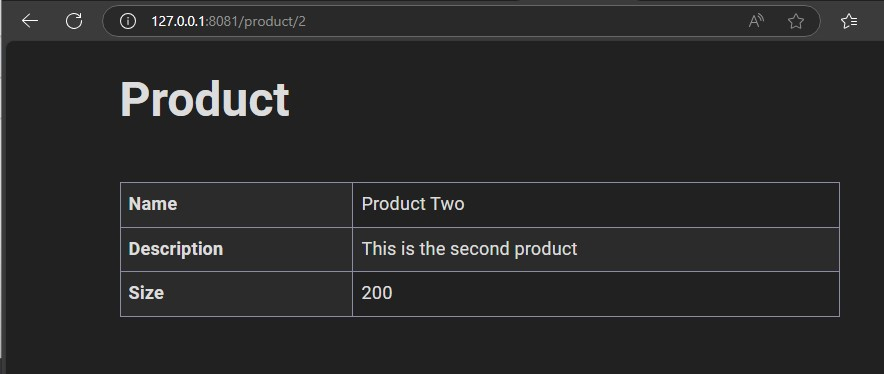
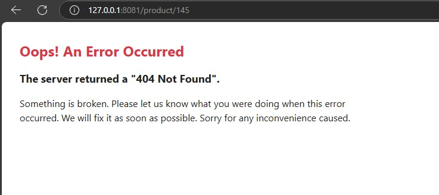
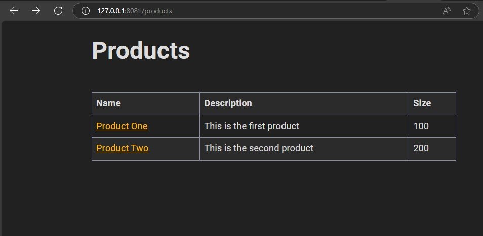

## Install

    composer create-project symfony/skeleton:"7.2.x" my_project_directory


## Debug bar Error

> Если не загружается debug toolbar, нужна строчка в конфигурации Apache

> Это также влияет на работу маршрутов, которые иначе могут не работать!

    FallbackResource /index.php

Пример

    ServerName symfony.local
    ServerAdmin webmaster@localhost
    DocumentRoot /home/user/server/symfony.local/public/
    <Directory /home/user/server/symfony.local/public/>
        Options Indexes FollowSymLinks MultiViews
        AllowOverride All
        Require all granted
        FallbackResource /index.php
    </Directory>

Ссылки

https://modern-develop.ru/blogs/oshibka-error-occurred-while-loading-web-debug-toolbar-v-symfony

https://symfony.com/doc/current/setup/web_server_configuration.html#apache

https://stackoverflow.com/questions/50059794/symfony-4-an-error-occurred-while-loading-the-web-debug-toolbar

## Twig

https://symfony.com/doc/current/templates.html

    composer require symfony/twig-bundle

## Code generators

> Наподобие php artisan в Laravel.

https://symfony.com/bundles/SymfonyMakerBundle/current/index.html

Аллиасы, другие названия для пакетов:

https://github.com/symfony/recipes/blob/flex/main/RECIPES.md

    php bin/console
    php bin/console list

    bin/console
    bin/console list

    composer require --dev symfony/maker-bundle
    # или, благодаря аллиасу,
    composer require maker --dev

После установки `maker` появляется куча команд make:... в списке команд bin/console list .  

Получение справки по командам bin/console:  

    bin/console help make:controller

Создать контроллер. Будет создан контроллер и шаблон.

    bin/console make:controller Product

    ->
    created: src/Controller/ProductController.php  
    created: templates/product/index.html.twig

Также можно создать контроллер не указав сначали имени, а когда CLI  спросит, указать это имя маленькими буквами. Будет создан контроллер ProductController.php и шаблон.

     bin/console make:controller
     > product

## Route names

Фyнкции Twig

https://symfony.com/doc/current/reference/twig_reference.html

Просмотр маршрутов

    bin/console debug:router

## Databases

Doctrine - доступ к БД наподобие PDO.

https://symfony.com/doc/current/doctrine.html   
https://symfony.ru/doc/current/doctrine.html

Установка Doctrine

    composer require symfony/orm-pack

Далее - настроить .env файл в корне проекта.  
Подсказки тут:  

https://symfony.com/doc/current/doctrine.html#configuring-the-database

https://symfony.ru/doc/current/doctrine.html#konfiguracia-bazy-dannyh

В списке команд добавились команды Doctrine, посмотреть

    bin/console list

Создать БД (в env была настроена база SQlite)

    bin/console doctrine:database:create 

## Entities

Объект класса Entities представляет собой отдельную запись в таблице базы данных.    
Создаём entity (сущность) и класс репозитория.  
Созданный файл entity (сущности) будет представлять собой одну таблицу.   

    bin/console make:entity product

Далее будет предложено ответить на вопросы м заполнить будущие свойства и поля

```
    root@e03c44a167a5:/var/www/html# bin/console make:entity product

    created: src/Entity/Product.php
    created: src/Repository/ProductRepository.php

    Entity generated! Now let's add some fields!
    You can always add more fields later manually or by re-running this command.

    New property name (press <return> to stop adding fields):
    > name

    Field type (enter ? to see all types) [string]:
    > string

    Field length [255]:
    > 128

    Can this field be null in the database (nullable) (yes/no) [no]:
    > no

    updated: src/Entity/Product.php
```

Это означает, что поле `name` и его свойства добавлены.  
Заполнение далее.  

```
 Add another property? Enter the property name (or press <return> to stop adding fields):
 > description

 Field type (enter ? to see all types) [string]:
 > text

 Can this field be null in the database (nullable) (yes/no) [no]:
 > yes

 updated: src/Entity/Product.php


 Add another property? Enter the property name (or press <return> to stop adding fields):
 > size

 Field type (enter ? to see all types) [string]:
 > integer

 Can this field be null in the database (nullable) (yes/no) [no]:
 >

 updated: src/Entity/Product.php


  Add another property? Enter the property name (or press <return> to stop adding fields):
 >

  Success!

 Next: When you're ready, create a migration with php bin/console make:migration

root@e03c44a167a5:/var/www/html#

```

Созданную сущность всё равно можно отредактировать вручную.

Справочник по созданным атрибутам таблицы в официальной документации Doctrine:  

https://www.doctrine-project.org/projects/doctrine-orm/en/3.3/reference/attributes-reference.html

По созданной сущности после миграции будет создана таблица в БД.  

## Migrations

Создать файл миграции

    bin/console make:migration

Запустить миграцию для создания таблицы в БД

    bin/console doctrine:migrations:migrate
    
    > yes

## Adminer не пускал. Решение

Суть:  
чтобы начать использовать SQLite, нужно войти c паролем в новых версиях Админера, но изначально у БД SQLite пароля нет или может не быть. Новые версии Админера не разрешают доступ к базам данных без пароля.  

Решение:  
Админеру был подсунут плагин, позволяющий использовать свой любой пароль для входа, не считающийся паролем пользователя базы данных.  

Вход:
- SQLite 3
- Имя    - пустое
- Пароль - из файла плагина
- База   - ../var/products.db

Часть контейнеров убрана из docker-compose. Они касались MySQL.  

https://www.developerload.com/how-to-enter-adminer-without-password-closed

## Fixtures

Способ заполнить таблицу БД.  

https://symfony.com/bundles/DoctrineFixturesBundle/current/index.html

    composer require --dev doctrine/doctrine-fixtures-bundle

Будет созданы папка и класс src\DataFixtures\AppFixtures.php

```php
    namespace App\DataFixtures;

    use Doctrine\Bundle\FixturesBundle\Fixture;
    use Doctrine\Persistence\ObjectManager;

    class AppFixtures extends Fixture
    {
        public function load(ObjectManager $manager): void
        {
            // $product = new Product();
            // $manager->persist($product);

            $manager->flush();
        }
    }
```

Этот класс нужно доработать вручную, заполнить будущими данными таблицы.

Далее команда, заполняющая таблицы.    
Перед ее запуском все данные из таблиц будут удалены.  

    bin/console doctrine:fixtures:load

Если нужно только добавить некоторые данные, то тогда с флагом --append

    bin/console doctrine:fixtures:load --append

Прямо из командной строки можно вводить SQL запросы и просматривать базу данных:

    bin/console dbal:run-sql "SELECT * FROM product"

## Service Container

https://symfony.com/doc/current/service_container.html

Получение данных из БД для вывода на экран.  
Используются helper методы типа findAll(), find($id) и др.:

https://symfony.com/doc/current/doctrine.html#fetching-objects-from-the-database

## Displaying data. CSS

https://simplecss.org/  
https://github.com/kevquirk/simple.css/wiki/Getting-Started-With-Simple.css  

## Profiler

Profiler нужен для доступа к SQL-запросам. Он добавляет tool-bar в низу страницы.

https://symfony.com/doc/current/profiler.html

Установка

    composer require --dev symfony/profiler-pack

## Reading records

Метод show($id)



Отображение страницы 404 со значением APP_ENV=prod в .env.  
С APP_ENV=dev отображается отладочная информация.  



Вместо использования такого метода

```php
    public function show($id, ProductRepository $repository): Response 
    {       
        $product = $repository->find($id);
       
        if ($product === null) {
            throw $this->createNotFoundException('Product not found');
        }

        return $this->render('product/show.html.twig', [
            'product' => $product
        ]);
    }
```

можно писать так

```php
 public function show(Product $product): Response 
    {
        return $this->render('product/show.html.twig', [
            'product' => $product
        ]);
    }

```

После настройки имени маршрута и создания ссылки в шаблоне работает переход по ссылкам и id.



## Forms

https://symfony.com/doc/current/forms.html

Установка

    composer require symfony/form

Форму можно создать внутри метода контроллера, 

https://symfony.com/doc/current/forms.html#creating-forms-in-controllers

но рекомендуется создать форму в отдельном классе, чтобы код контроллера был максимально коротким и простым.  

https://symfony.com/doc/current/forms.html#creating-form-classes  

Создаём класс фомы через Maker:  

    bin/console make:form

Далее будут заданы вопросы о названии класса, сущности, ответы такие:    
    
    > Product
    > Product 

В результате в папке source/form будет создан класс ProductType.  
После некоторых добавлений кода, будет отображаться форма.  

---

Типы форм. Form Types  

https://symfony.com/doc/current/forms.html#form-types

https://symfony.com/doc/current/reference/forms/types.html

https://symfony.com/doc/current/reference/forms/types/submit.html

---

Ручная настройка форм

https://symfony.com/doc/current/form/form_customization.html#form-functions-and-variables-reference


